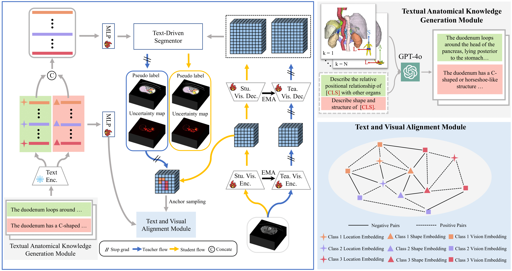
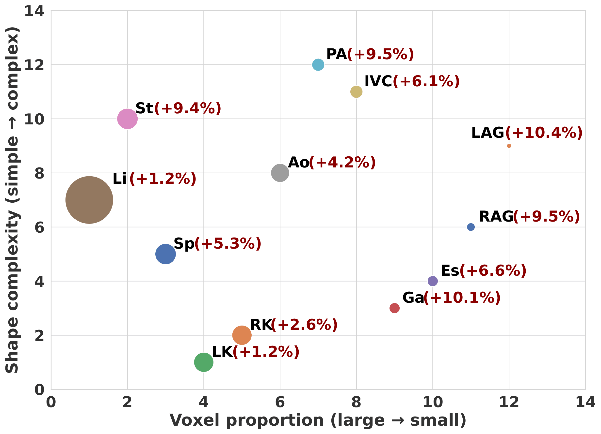
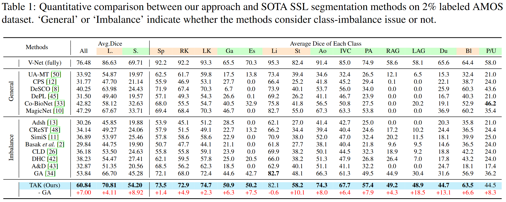
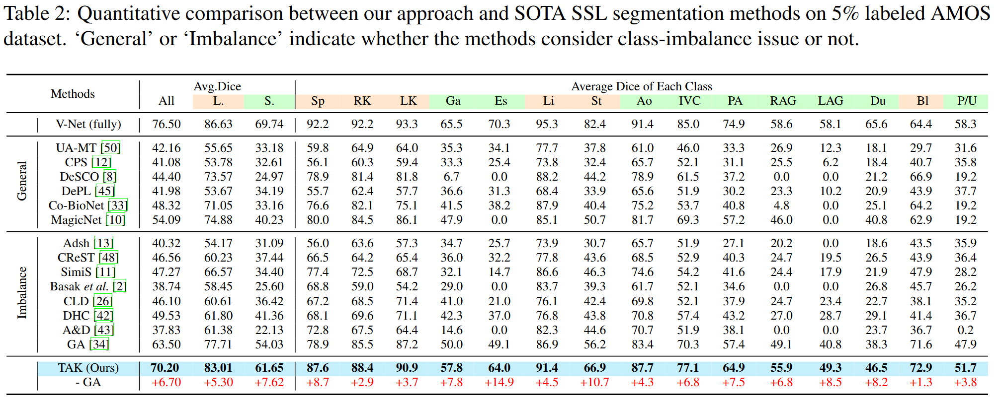
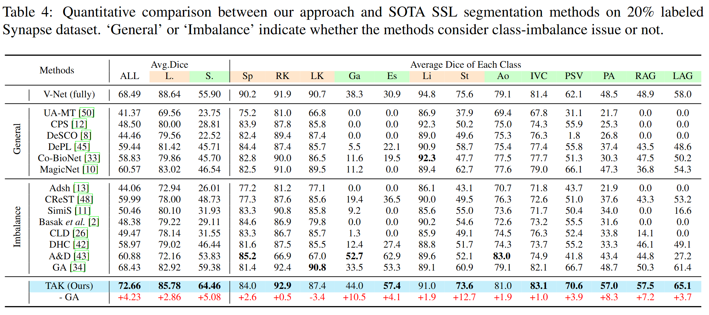

  <h1 align="center"> Leveraging Textual Anatomical Knowledge for Class-Imbalanced Semi-Supervised Multi-Organ Segmentation</h1>
  

  

## Overview

Annotating 3D medical images demands substantial time and expertise, driving the adoption of semi-supervised learning (SSL) for segmentation tasks. However, the complex anatomical structures of organs often lead to significant class imbalances, posing major challenges for deploying SSL in real-world scenarios. Despite the availability of valuable prior information, such as inter-organ relative positions and organ shape priors, existing SSL methods have yet to fully leverage these insights.
To address this gap, we propose a novel approach that integrates textual anatomical knowledge (TAK) into the segmentation model. Specifically, we use GPT-4o to generate textual descriptions of anatomical priors, which are then encoded using a CLIP-based model. These encoded priors are injected into the segmentation model as parameters of the segmentation head. Additionally, contrastive learning is employed to enhance the alignment between textual priors and visual features.
Extensive experiments demonstrate the superior performance of our method, significantly surpassing state-of-the-art approaches.

## Dataset
Please refer to <a href="https://github.com/cicailalala/GALoss?tab=readme-ov-file">GALoss</a> for downloading the preprocessed data

#### AMOS
The dataset can be downloaded from https://amos22.grand-challenge.org/Dataset/

#### Synapse
The MR imaging scans are available at https://www.synapse.org/#!Synapse:syn3193805/wiki/.
Please sign up and download the dataset. 

## Result

#### AMOS
Trained with 2% labeled data_

Trained with 5% labeled data_

#### Synapse
Trained with 10% labeled data_

Trained with 20% labeled data_

## License
This project is licensed under the MIT License

## Acknowledgements

Big thanks to these amazing works!

 - https://github.com/xmed-lab/DHC/tree/main
 - https://github.com/DeepMed-Lab-ECNU/MagicNet?tab=readme-ov-file
 - https://github.com/cicailalala/GALoss?tab=readme-ov-file
