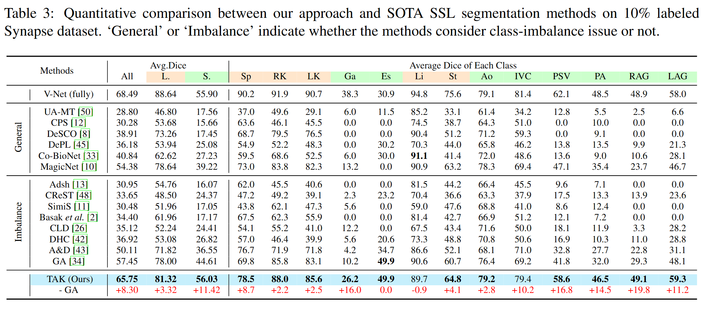

  <h1 align="center">⭐ Leveraging Textual Anatomical Knowledge for Class-Imbalanced Semi-Supervised Multi-Organ Segmentation ⭐</h1>

  

---

## 🚀 Overview

  

Annotating 3D medical images requires extensive time and expertise, making semi-supervised learning (SSL) a practical approach for segmentation. However, the inherent class imbalance due to complex anatomical structures poses significant challenges for SSL models.

Despite the availability of valuable prior knowledge—such as inter-organ relative positions and shape priors—existing SSL methods fail to effectively utilize these insights. To bridge this gap, we introduce **Textual Anatomical Knowledge (TAK)**:

✅ **Harnessing MLLM** to generate textual descriptions of anatomical priors.
✅ **Encoding anatomical prior knowledge** using a CLIP-based model.
✅ **Injecting TAK** into the segmentation model as parameters of the segmentation head.
✅ **Enhancing visual&textual feature alignment** via contrastive learning.

Extensive experiments validate our method’s superiority, significantly outperforming state-of-the-art approaches! 🎯

  

---

## 📂 Dataset

### 📌 AMOS
🔗 [AMOS Dataset](https://amos22.grand-challenge.org/Dataset/)

### 📌 Synapse
🔗 [Synapse Dataset](https://www.synapse.org/#!Synapse:syn3193805/wiki/)

🔹 Preprocessed data available at **[GALoss Repository](https://github.com/cicailalala/GALoss?tab=readme-ov-file)**.

---

## 📊 Results

### 📌 AMOS
🟢 **Trained with 2% labeled data**

  

🟢 **Trained with 5% labeled data**

  

### 📌 Synapse
🟢 **Trained with 10% labeled data**

  

🟢 **Trained with 20% labeled data**

  

---

## 📜 License
This project is licensed under the **MIT License**.

---

## 🙌 Acknowledgements
Special thanks to these amazing projects that inspired our work:

🔹 [DHC](https://github.com/xmed-lab/DHC/tree/main)  
🔹 [MagicNet](https://github.com/DeepMed-Lab-ECNU/MagicNet?tab=readme-ov-file)  
🔹 [GALoss](https://github.com/cicailalala/GALoss?tab=readme-ov-file)  

---

💡 *For any questions, feel free to reach out!* 📩
